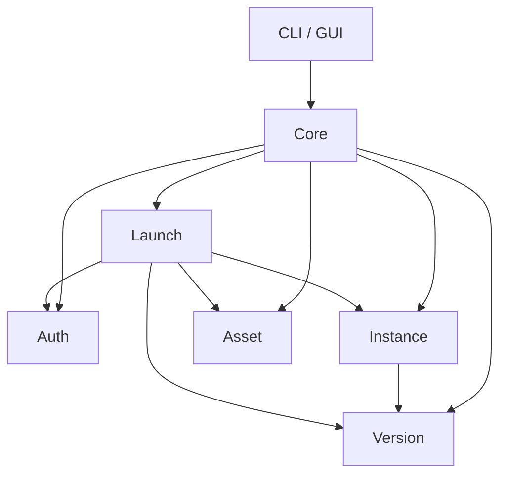

# gLauncher - Minecraft Java Edition ランチャー要件定義書

## 1. プロジェクト概要

### 1.1 プロジェクト名
**gLauncher** - 軽量・カスタマイズ可能なMinecraft Java Edition ランチャー

### 1.2 コンセプト
| コンセプト | 説明 |
|-----------|------|
| **軽量** | 最小限のリソース使用、高速起動、低メモリフットプリント |
| **カスタマイズ** | ユーザーが自由に設定を変更可能、テーマ対応 |
| **拡張性** | プラグインシステム、Mod対応、カスタムプロファイル |

### 1.3 動作モード
```
┌─────────────────────────────────────────────────────────────┐
│  gLauncher                                                   │
├─────────────────────────────────────────────────────────────┤
│  $ glauncher                    → GUIモード（インスタンス管理）│
│  $ glauncher --instance "name"  → CLIモード（直接起動）       │
│  $ glauncher --profile "name"   → プロファイル指定起動        │
└─────────────────────────────────────────────────────────────┘
```

---

## 2. 機能要件

### 2.1 コア機能

#### 2.1.1 認証システム
- [ ] Microsoft認証（OAuth 2.0）
- [ ] オフラインモード対応
- [ ] 複数アカウント管理
- [ ] セッション永続化（セキュアなトークン保存）

#### 2.1.2 バージョン管理
- [ ] 公式バージョン一覧取得（version_manifest_v2.json）
- [ ] Release / Snapshot / Old版のフィルタリング
- [ ] バージョンダウンロード・キャッシュ管理
- [ ] OptiFine / Fabric / Forge 等のModローダー対応

#### 2.1.3 インスタンス管理
- [ ] インスタンスの作成・複製・削除
- [ ] インスタンスごとの設定（Java引数、メモリ割り当て）
- [ ] インスタンスのエクスポート・インポート
- [ ] ワールドデータのバックアップ

#### 2.1.4 アセット管理
- [ ] アセットのダウンロード・検証（SHA1ハッシュ）
- [ ] ライブラリの依存関係解決
- [ ] ネイティブライブラリの展開

### 2.2 GUI機能

#### 2.2.1 メイン画面
- [ ] インスタンス一覧（グリッド/リスト表示切替）
- [ ] クイック起動ボタン
- [ ] アカウント切替UI
- [ ] 設定へのアクセス

#### 2.2.2 インスタンス詳細
- [ ] バージョン情報表示
- [ ] Mod一覧・管理
- [ ] スクリーンショットビューア
- [ ] ログビューア

#### 2.2.3 設定画面
- [ ] Java実行環境の設定（パス、メモリ）
- [ ] ランチャー設定（テーマ、言語）
- [ ] ネットワーク設定（プロキシ対応）

### 2.3 CLI機能

#### 2.3.1 コマンド体系
```bash
# 基本コマンド
glauncher                           # GUIを起動
glauncher --version                 # バージョン表示
glauncher --help                    # ヘルプ表示

# インスタンス操作
glauncher --instance <name>         # インスタンスを直接起動
glauncher --instance <name> --offline  # オフラインモードで起動
glauncher list                      # インスタンス一覧
glauncher create <name> --version <ver>  # インスタンス作成

# プロファイル操作
glauncher --profile <name>          # プロファイル指定起動

# 認証
glauncher auth login                # ログイン
glauncher auth logout               # ログアウト
glauncher auth status               # 認証状態確認
```

---

## 3. 非機能要件

### 3.1 パフォーマンス
| 項目 | 目標値 |
|------|--------|
| 起動時間 | < 1秒（GUIモード） |
| メモリ使用量 | < 50MB（アイドル時） |
| ダウンロード | 並列ダウンロード対応 |

### 3.2 セキュリティ
- [ ] 認証トークンの暗号化保存
- [ ] HTTPS通信の強制
- [ ] ダウンロードファイルのハッシュ検証

### 3.3 互換性
- [ ] Windows 10/11
- [ ] macOS 12+
- [ ] Linux（Ubuntu 22.04+, Fedora 38+, Arch Linux）

### 3.4 ローカライゼーション
- [ ] 日本語（デフォルト）
- [ ] 英語
- [ ] 言語ファイルによる拡張対応

---

## 4. 技術仕様

### 4.1 言語・フレームワーク
| 用途 | 技術 |
|------|------|
| 言語 | Rust (Edition 2024) |
| GUI | **egui + eframe** |
| 非同期 | tokio |
| HTTP | reqwest |
| シリアライズ | serde + serde_json |
| CLI | clap |
| ログ | tracing |
| 暗号化 | keyring（OS標準キーチェーン） |

### 4.2 データ保存
```
~/.glauncher/
├── config.toml           # ランチャー設定
├── accounts.json.enc     # 暗号化されたアカウント情報
├── instances/
│   ├── <instance-name>/
│   │   ├── instance.toml # インスタンス設定
│   │   ├── .minecraft/   # ゲームデータ
│   │   └── mods/         # Mod
├── versions/             # バージョンキャッシュ
├── assets/               # アセットキャッシュ
└── libraries/            # ライブラリキャッシュ
```

### 4.3 設定ファイル形式

#### config.toml（ランチャー設定）
```toml
[general]
theme = "dark"
language = "ja"
check_updates = true

[java]
path = "/usr/bin/java"
min_memory = "512M"
max_memory = "4G"
extra_args = []

[network]
proxy = ""
concurrent_downloads = 4
```

#### instance.toml（インスタンス設定）
```toml
[instance]
name = "Vanilla 1.21"
version = "1.21"
loader = "vanilla"  # vanilla, fabric, forge, quilt
created_at = "2024-12-26T00:00:00Z"

[java]
override = false
path = ""
min_memory = ""
max_memory = ""
extra_args = []

[game]
resolution_width = 1920
resolution_height = 1080
fullscreen = false
```

---

## 5. アーキテクチャ

### 5.1 モジュール構成
```
src/
├── main.rs              # エントリーポイント
├── lib.rs               # ライブラリルート
├── cli/                 # CLIモジュール
│   ├── mod.rs
│   ├── commands.rs
│   └── args.rs
├── gui/                 # GUIモジュール
│   ├── mod.rs
│   ├── app.rs
│   ├── views/
│   └── components/
├── core/                # コアロジック
│   ├── mod.rs
│   ├── auth/            # 認証
│   │   ├── microsoft.rs
│   │   └── offline.rs
│   ├── version/         # バージョン管理
│   │   ├── manifest.rs
│   │   └── download.rs
│   ├── instance/        # インスタンス管理
│   │   ├── manager.rs
│   │   └── config.rs
│   ├── launch/          # 起動ロジック
│   │   ├── launcher.rs
│   │   └── process.rs
│   └── asset/           # アセット管理
│       ├── asset.rs
│       └── library.rs
├── config/              # 設定管理
│   ├── mod.rs
│   └── schema.rs
└── util/                # ユーティリティ
    ├── mod.rs
    ├── crypto.rs
    └── download.rs
```

### 5.2 依存関係図


---

## 6. 拡張性設計

### 6.1 プラグインシステム（将来的）
- [ ] Lua / Rhai スクリプト対応
- [ ] プラグインAPI定義
- [ ] サンドボックス実行環境

### 6.2 テーマシステム
- [ ] JSONベースのテーマ定義
- [ ] カスタムCSSサポート（GUI依存）
- [ ] ダークモード / ライトモード

### 6.3 Modローダー対応
| ローダー | 優先度 | フェーズ |
|----------|--------|----------|
| Vanilla | 最高 | Phase 1 |
| Fabric | 高 | Phase 2-3 |
| Forge | 中 | Phase 4 |
| Quilt | 低 | 将来検討 |
| NeoForge | 低 | 将来検討 |

---

## 7. 開発ロードマップ

### Phase 1: 基盤構築（MVP）
- [ ] プロジェクト構造の確立
- [ ] 設定ファイルの読み書き
- [ ] Microsoft認証の実装
- [ ] バージョンマニフェストの取得
- [ ] CLIによる基本起動

### Phase 2: コア機能
- [ ] インスタンス管理
- [ ] アセット・ライブラリのダウンロード
- [ ] ゲーム起動ロジック
- [ ] オフラインモード

### Phase 3: GUI実装
- [ ] GUIフレームワーク選定・導入
- [ ] メイン画面の実装
- [ ] インスタンス管理UI
- [ ] 設定画面

### Phase 4: 拡張機能
- [ ] Fabric / Forge対応
- [ ] Mod管理機能
- [ ] テーマシステム

### Phase 5: 完成・配布
- [ ] クロスプラットフォームビルド
- [ ] インストーラー作成
- [ ] ドキュメント整備

---

## 8. 参考リソース

### 8.1 公式API
- [Version Manifest](https://piston-meta.mojang.com/mc/game/version_manifest_v2.json)
- [Microsoft Authentication](https://docs.microsoft.com/en-us/azure/active-directory/develop/v2-oauth2-auth-code-flow)
- [Xbox Live API](https://docs.microsoft.com/en-us/gaming/xbox-live/)

### 8.2 参考実装
- [HMCL](https://github.com/huanghongxun/HMCL) - Java製ランチャー
- [MultiMC](https://github.com/MultiMC/Launcher) - C++製ランチャー
- [Prism Launcher](https://github.com/PrismLauncher/PrismLauncher) - MultiMCフォーク

---

## 9. 決定事項

### 全項目確定 ✅

| 項目 | 決定内容 | 備考 |
|------|----------|------|
| GUIフレームワーク | **egui + eframe** | 軽量、高速起動、シンプルなAPI |
| 暗号化方式 | **keyring** | OS標準キーチェーン利用 |
| 自動アップデート | **対応する** | `self_update`クレート使用 |
| Modローダー優先度 | **Fabric優先** | Fabric安定後にForge対応 |

### Modローダー対応ロードマップ

```
Phase 2-3: Fabric対応
    ↓ 安定確認
Phase 4:   Forge対応追加
    ↓
Phase 4+:  Quilt / NeoForge（検討）
```

---

## 付録A: 用語集

| 用語 | 説明 |
|------|------|
| インスタンス | Minecraftの独立した実行環境。バージョン、Mod、設定を個別に管理 |
| プロファイル | 起動時の設定セット（Java引数、解像度など） |
| アセット | ゲームのリソースファイル（サウンド、言語ファイルなど） |
| ライブラリ | ゲーム実行に必要な外部Jarファイル |
| Modローダー | ModをMinecraftに適用するためのフレームワーク |

---

*作成日: 2025-12-26*
*バージョン: 1.0.0*
